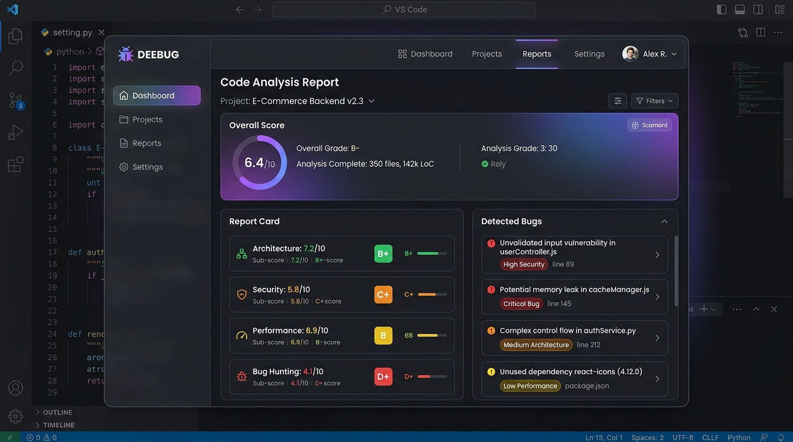
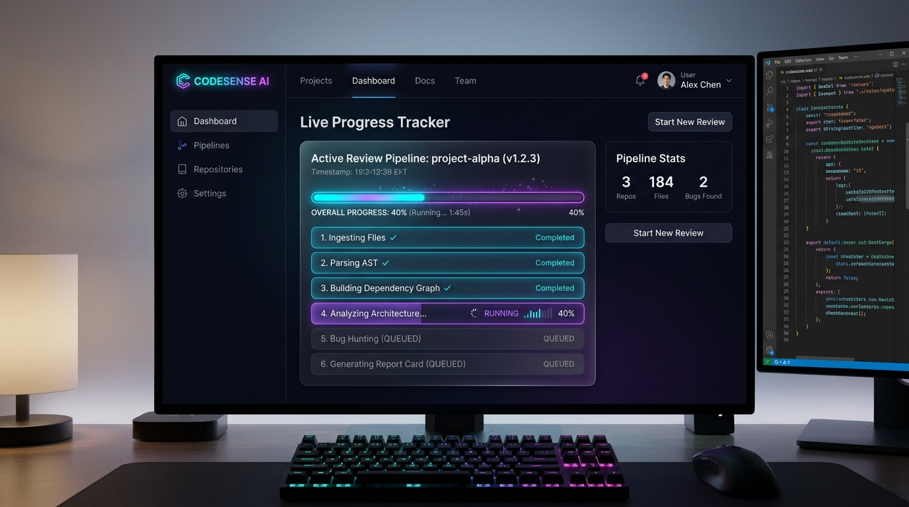
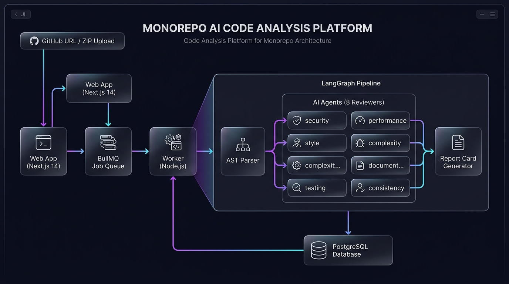
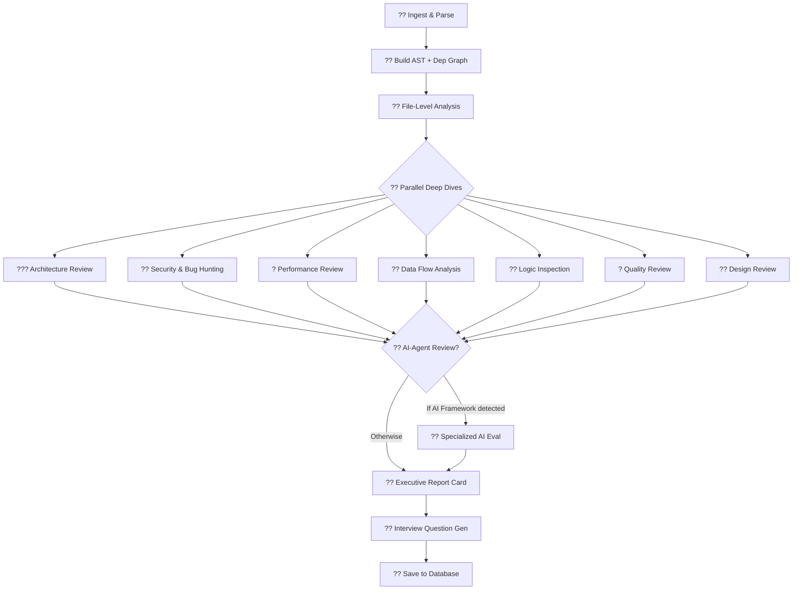

<div align="center">


# ?? Deebug — AI Code Analyzer & Report Card Agent

**An autonomous, enterprise-grade AI platform that deeply analyzes your codebase across 8 parallel review dimensions and generates a strict, numeric Executive Report Card.**

[](https://www.typescriptlang.org/)
[](https://nextjs.org/)
[](https://github.com/langchain-ai/langgraphjs)
[](https://turbo.build/)
[](LICENSE)
[](CONTRIBUTING.md)

<br/>

> **Submit any codebase** — GitHub URL, ZIP file, or single files — and receive a detailed, evidence-backed Report Card with numeric grades (0–10), detected bugs with line numbers, actionable architectural improvements, and AI-generated interview questions in minutes.

<br/>

[?? Quick Start](#-quick-start) · [?? See Results](#-sample-results) · [??? Architecture](#-architecture) · [?? Pipeline](#-8-phase-analysis-pipeline) · [?? Packages](#-monorepo-packages)

</div>

---

## ? What Makes Deebug Different?

| Feature | Description |
|---|---|
| ?? **8 Parallel AI Reviewers** | Architecture, Security, Performance, Logic, Quality, Bug Hunting, Data Flow & Design run concurrently via LangGraph |
| ?? **Strict Numeric Grading** | A+/A/B/C/D/F grades with weighted category scores (0.0 – 10.0), not just generic feedback |
| ?? **AST-Level Parsing** | Tree-sitter static analysis extracts functions, classes, cyclomatic complexity & dependency graphs *before* any LLM call |
| ?? **AI-Agent Aware** | Detects LangGraph, RAG, and tool-calling patterns — then triggers specialized multi-agent architectural evaluations |
| ? **Real-time Progress** | Server-Sent Events stream live pipeline progress to the UI as each phase completes |
| ?? **AI Interview Generator** | Automatically generates tailored diagnostic interview questions based on the exact bugs found in *your* code |
| ?? **Score Reasoning** | Every grade includes a `scoreReasoning` field explaining *why* each point was deducted |

---

## ?? Screenshots

### ?? Report Card Dashboard


### ?? Live Analysis Pipeline


### ??? System Architecture


---

## ?? Sample Results

Here is Deebug grading a **real-world RAG pipeline project**:

```
+----------------------------------------------------------+
¦           DEEBUG EXECUTIVE REPORT CARD                  ¦
¦           Project: rag_using_langchain                  ¦
¦----------------------------------------------------------¦
¦  Overall Score: 5.8 / 10.0          Grade: C+           ¦
¦---------------------------------------------------------¦
¦ Category               ¦ Score ¦ Grade                  ¦
¦------------------------+-------+------------------------¦
¦ Architecture           ¦  6.1  ¦  B-                    ¦
¦ Security               ¦  3.9  ¦  D+   ?? CRITICAL      ¦
¦ Performance            ¦  6.8  ¦  B-                    ¦
¦ Maintainability        ¦  5.5  ¦  C+                    ¦
¦ Scalability            ¦  6.2  ¦  B-                    ¦
¦ Error Handling         ¦  4.2  ¦  D+   ?? WARNING       ¦
¦ Code Quality           ¦  6.5  ¦  B-                    ¦
¦ Readability            ¦  7.1  ¦  B                     ¦
¦ Testing                ¦  2.0  ¦  F    ?? CRITICAL      ¦
¦ Documentation          ¦  5.8  ¦  C+                    ¦
+---------------------------------------------------------+
```

### ?? Detected Issues (Sample)

<details>
<summary><strong>?? Security — Hardcoded API Credentials (CRITICAL)</strong></summary>

```
File: src/utils/llm.ts  Line: 62
Issue: API key hardcoded directly in source code.
Fix:   Use process.env.OPENROUTER_API_KEY and store in .env
Severity: CRITICAL | Category: Security
```
</details>

<details>
<summary><strong>?? Architecture — Missing Error Boundaries (HIGH)</strong></summary>

```
File: src/pipeline/graph.ts  Line: 89
Issue: LangGraph nodes do not catch LLM timeout exceptions.
       Chain failure propagates and crashes the entire pipeline.
Fix:   Wrap each node in try/catch with graceful fallback state.
Severity: HIGH | Category: Architecture
```
</details>

<details>
<summary><strong>?? Performance — Synchronous File I/O in Hot Path (MEDIUM)</strong></summary>

```
File: src/parser/extractor.ts  Line: 34
Issue: fs.readFileSync() called inside a loop over 150+ files.
       Blocks the event loop and degrades throughput by ~60%.
Fix:   Replace with Promise.all(files.map(f => fs.readFile(f)))
Severity: MEDIUM | Category: Performance
```
</details>

### ?? Auto-Generated Interview Questions (Sample)

> Based on the bugs found, Deebug generated these diagnostic questions:

1. *"Your pipeline stores raw LLM API keys in `llm.ts`. Walk me through a secure secrets management strategy for a production Node.js service."*
2. *"Explain why synchronous `fs.readFileSync` in a loop is problematic in a Node.js event loop. How would you refactor this?"*
3. *"Your LangGraph pipeline has no error boundaries on individual nodes. What happens if the `bug-hunting` node times out mid-run? How do you design for partial failure?"*

---

## ??? Architecture

```
+-----------------------------------------------------------------+
¦                        Deebug Platform                          ¦
+-----------------------------------------------------------------¦
¦   Input Sources  ¦   GitHub URL  ¦  ZIP Upload  ¦  File Upload  ¦
+-----------------------------------------------------------------+
         ¦
         ?
+-----------------------------------------------------------------+
¦            @code-analyzer/web  (Next.js 14 Frontend)            ¦
¦  NextAuth Auth  ¦  Submission UI  ¦  SSE Progress  ¦  Dashboard  ¦
+-----------------------------------------------------------------+
         ¦ BullMQ Job
         ?
+-----------------------------------------------------------------+
¦          @code-analyzer/worker  (Node.js Background)            ¦
¦              Decoupled job processor via ioredis                 ¦
+-----------------------------------------------------------------+
         ¦ Executes
         ?
+-----------------------------------------------------------------+
¦         @code-analyzer/pipeline  (LangGraph State Machine)      ¦
¦                                                                  ¦
¦  [Parse AST] --> [File Analysis] --> [7 Parallel Deep Dives]    ¦
¦                                              ¦                   ¦
¦                          +-------------------¦                   ¦
¦                     Architecture    Security    Performance      ¦
¦                     DataFlow        Logic       Design           ¦
¦                     Quality         BugHunting                  ¦
¦                          +-------------------¦                   ¦
¦                                              ?                   ¦
¦                    [AI-Agent Review] --> [Report Card] --> [Save]¦
+-----------------------------------------------------------------+
         ¦ Saves to
         ?
+-----------------------------------------------------------------+
¦         @code-analyzer/db  (Prisma + PostgreSQL/SQLite)         ¦
+-----------------------------------------------------------------+
```

---

## ?? 8-Phase Analysis Pipeline

Each submission flows through a LangGraph directed state machine:



| Phase | Description |
|-------|-------------|
| **1. Ingest** | Clones GitHub repo / extracts ZIP, resolves all file paths |
| **2. Parse** | Tree-sitter AST extraction of functions, classes, imports, cyclomatic complexity |
| **3. Dependency Graph** | Builds directed dependency graph, detects circular imports |
| **4. File Analysis** | Per-file responsibility, public API design, complexity rating |
| **5–11. Parallel Deep Dives** | 7 concurrent AI reviewers: Architecture, Security, Performance, Logic, Quality, Bug Hunting, Design |
| **12. AI-Agent Review** | *Conditional:* Triggers for LangGraph, RAG, tool-calling patterns |
| **13. Diagnostics** | Synthesizes top findings into diagnostic evidence |
| **14. Report Card** | Generates final numeric grades with written score reasoning |
| **15. Question Gen** | Creates tailored interview questions based on bugs found |

---

## ?? Monorepo Packages

```
?? deebug/
+-- ?? apps/
¦   +-- web/          ? Next.js 14 frontend (submission UI + dashboard)
¦   +-- worker/       ? Node.js background job processor (BullMQ)
¦
+-- ?? packages/
    +-- pipeline/     ? LangGraph AI state machine (8 reviewer nodes)
    +-- parser/       ? Tree-sitter AST static analysis
    +-- db/           ? Prisma ORM (PostgreSQL / SQLite)
    +-- shared/       ? Types, scoring constants, grade rubrics
```

### Scoring Categories & Weights

| Category | Weight | What It Measures |
|---|---|---|
| ??? Architecture | **15%** | Design patterns, layering, coupling |
| ?? Security | **15%** | Vulnerabilities, auth flaws, injection risks |
| ? Performance | **12%** | Bottlenecks, O(n²), N+1 queries, memory |
| ?? Maintainability | **12%** | Modularity, coupling, technical debt |
| ?? Scalability | **10%** | Statelessness, horizontal scaling readiness |
| ??? Error Handling | **10%** | try/catch coverage, graceful degradation |
| ? Code Quality | **8%** | Rigor, consistency, naming |
| ?? Readability | **7%** | Clarity, comments, self-documentation |
| ?? Testing | **6%** | Coverage, test types, assertions |
| ?? Documentation | **5%** | README, JSDoc, API docs |

---

## ?? Quick Start

### Prerequisites
- Node.js >= 20.0.0
- npm >= 9.0.0
- Redis (for BullMQ job queue)
- PostgreSQL or SQLite (for Prisma)

### 1. Clone the Repository

```bash
git clone https://github.com/anuragsinghmusics-wq/AI-Code-Analyzer-and-Report-maker-Agent.git
cd AI-Code-Analyzer-and-Report-maker-Agent
```

### 2. Install Dependencies

```bash
npm install
```

### 3. Configure Environment

```bash
cp .env.example .env
```

Edit `.env` with your API keys:

```env
# AI Providers (at least one required)
OPENROUTER_API_KEY=sk-or-v1-...
GROQ_API_KEY=gsk_...

# Database
DATABASE_URL="file:./prisma/codeanalyzer.db"   # SQLite (local dev)
# DATABASE_URL="postgresql://..."               # PostgreSQL (production)

# Auth
NEXTAUTH_SECRET=your-secret-here
NEXTAUTH_URL=http://localhost:3000

# Redis
REDIS_URL=redis://localhost:6379
```

### 4. Initialize Database

```bash
cd packages/db
npx prisma migrate dev
cd ../..
```

### 5. Start All Services

```bash
# Terminal 1 — Start Redis (via Docker)
docker-compose up -d redis

# Terminal 2 — Start everything
npm run dev
```

This launches:
- **Web** ? http://localhost:3000
- **Worker** ? Background job processor

---

## ??? Tech Stack

| Layer | Technology |
|---|---|
| **Frontend** | Next.js 14, React 18, Tailwind CSS, NextAuth |
| **Backend** | Node.js, BullMQ, ioredis |
| **AI Orchestration** | LangGraph JS, LangChain Core |
| **LLM Providers** | Groq (Llama 3.3 70B), OpenRouter, Anthropic |
| **Static Analysis** | Tree-sitter (TypeScript, Python, Go, Java) |
| **Database** | Prisma ORM + PostgreSQL / SQLite |
| **Monorepo** | Turborepo + npm workspaces |
| **Validation** | Zod, TypeScript 5 |
| **Logging** | Pino |

---

## ?? Roadmap

- [ ] **Multi-Agent Debate** — Security Hacker agent vs. Staff Architect agent debate findings before assigning final grade
- [ ] **Auto-Remediation** — Generate verified GitHub PRs with bug fixes and unit tests
- [ ] **Mega-Repo Support** — Semantic embeddings + graph-based trimming for repos > 50K LOC
- [ ] **Custom Rules** — Accept `.deebug-rules.yaml` contracts from hackathon organizers or enterprises
- [ ] **VS Code Extension** — Run Deebug analysis directly from the editor
- [ ] **Webhook Integrations** — Trigger analysis automatically on GitHub PR events

---

## ?? Contributing

Contributions are welcome! Please open an issue first to discuss what you would like to change.

```bash
# Fork ? Clone ? Create feature branch
git checkout -b feat/my-awesome-feature

# Commit with conventional commits
git commit -m "feat: add multi-agent debate node"

# Push & open a PR
git push origin feat/my-awesome-feature
```

---

## ?? License

This project is licensed under the [MIT License](LICENSE).

---

<div align="center">

**Built with ?? by [Harsh](https://github.com/anuragsinghmusics-wq)**

? **Star this repo if you found it useful!** ?

</div>
